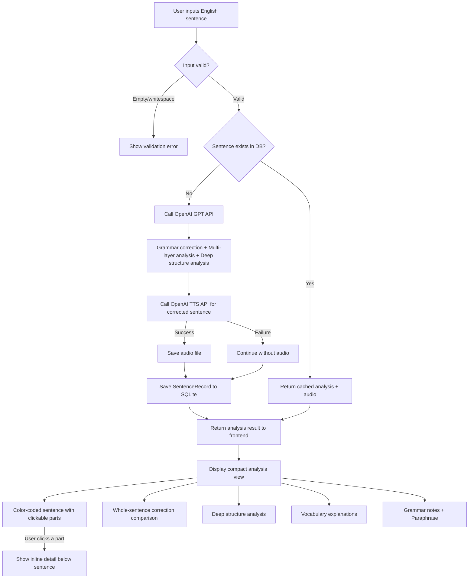
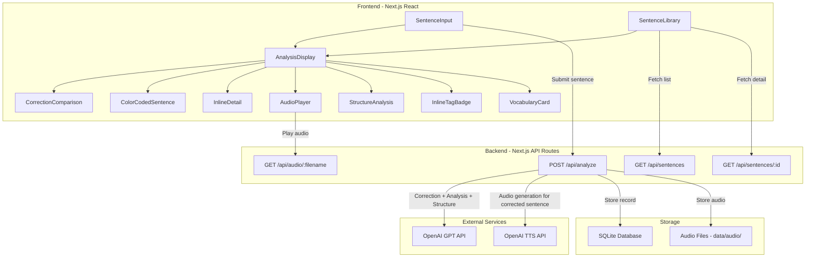
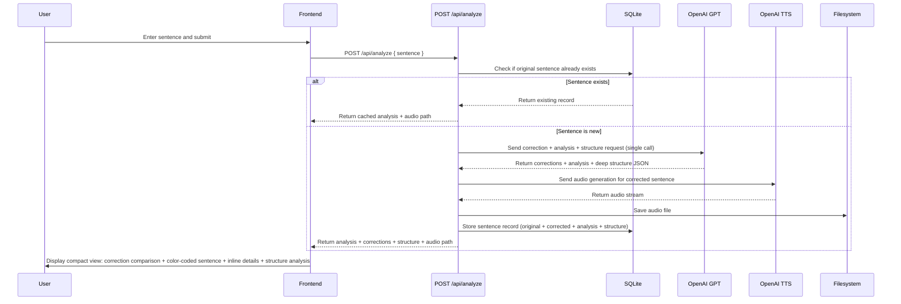

# Design Document

## Overview

A full-stack single-page application built with Next.js (App Router) for deep English sentence learning. Users submit English sentences, and the system first auto-corrects spelling/grammar errors, then performs multi-layer linguistic analysis (clause structure, phrase-level chunking, CET-4+ vocabulary, deep structural analysis) via OpenAI GPT API and generates audio via OpenAI TTS API. Results are displayed compactly within one viewport: a color-coded sentence with clickable parts showing inline details, whole-sentence correction comparison, vocabulary explanations, and deep structure breakdowns. All analysis results and audio are persisted to SQLite and local filesystem, forming a chronological sentence library for review.

The target user scored 80 on TOEFL with CET-4 vocabulary level (~3500 words). The vocabulary analysis targets words above CET-4 level, and the deep structure analysis breaks down how complex sentences are constructed in accessible language.

The entire application is English-only — all UI text, analysis output, labels, and prompts are in English.

The UI uses a modern, minimalist design with clean typography, generous whitespace, and subtle colors. The analysis section uses a two-column layout (sentence structure on the left, vocabulary cards on the right) so learners can study both simultaneously. Context tags are displayed as small inline badges next to the sentence, not as a separate editor section. Vocabulary definitions are concise (one sentence) with an example sentence for each word.

Tech stack: Next.js 15 (App Router) + TypeScript + SQLite (better-sqlite3) + OpenAI API

## Core User Flow



## Architecture



### Request Flow



## Components and Interfaces

### Backend Components

#### 1. OpenAI Service Layer (`lib/openai.ts`)

```typescript
async function analyzeSentence(sentence: string): Promise<AnalysisResult>
async function generateAudio(sentence: string): Promise<Buffer>
```

- `analyzeSentence`: Uses OpenAI Chat Completions API with `response_format: { type: "json_schema" }` for structured output. Model: `gpt-4o-mini`. The single GPT call handles grammar correction, multi-layer analysis, AND deep structure analysis — the prompt instructs the model to first correct the sentence, then analyze the corrected version including structural breakdown.
- `generateAudio`: Uses OpenAI TTS API (`tts-1` model, `alloy` voice), returns MP3 audio Buffer. Audio is generated for the **corrected** sentence.

#### 2. Database Layer (`lib/db.ts`)

```typescript
function initDatabase(): void
function findSentenceByText(sentence: string): SentenceRecord | undefined
function insertSentence(record: Omit<SentenceRecord, 'id'>): SentenceRecord
function getAllSentences(): SentenceRecord[]
function getSentenceById(id: number): SentenceRecord | undefined
```

Uses `better-sqlite3` synchronous API. Duplicate detection matches on the **original** sentence text.

#### 3. API Routes

| Route | Method | Description | Request/Params | Response |
|-------|--------|-------------|----------------|----------|
| `/api/analyze` | POST | Correct + analyze + structure | `{ sentence: string }` | `{ id, sentence, correctedSentence, analysis, audioPath, createdAt }` |
| `/api/sentences` | GET | List all sentences | - | `SentenceRecord[]` |
| `/api/sentences/[id]` | GET | Get sentence detail | URL param `id` | `SentenceRecord` |
| `/api/audio/[filename]` | GET | Serve audio file | URL param `filename` | Audio stream (MP3) |

### Frontend Components

#### 1. Page Layout (`app/page.tsx`) (UPDATED)

Single-page app with modern, minimalist design — clean typography, generous whitespace, subtle colors:
- Top: Sentence input area
- Middle: Analysis display section
  - Correction comparison (if corrections exist)
  - Sentence header: color-coded sentence + inline tag badge + audio player (all in one row area)
  - Two-column analysis: left column (selected component detail, clauses, structure analysis, grammar notes, paraphrase) | right column (vocabulary cards)
- Bottom: Sentence library list

The two-column layout ensures sentence structure and vocabulary are visible simultaneously. On mobile, it collapses to a single column.

#### 2. SentenceInput Component

- Text input field + submit button
- Input validation (reject blank content)
- Loading state during submission
- Error message display

#### 3. CorrectionComparison Component (UPDATED)

- Displays **only** a whole-sentence side-by-side comparison of original vs. corrected sentence
- Only rendered when corrections exist (corrections array is non-empty)
- Highlights the specific differences between original and corrected
- **No individual correction cards** — removed to keep the display compact

#### 4. ColorCodedSentence Component (UPDATED — Index-Based Rendering)

- Accepts a new `correctedSentence` string prop in addition to `components`
- Renders the sentence by iterating through the `correctedSentence` using `startIndex`/`endIndex` from each GrammarComponent to slice and color-code spans
- Fills gaps between components (characters not covered by any component) with unstyled text
- Does NOT concatenate `comp.text` fields — this was the source of a text duplication bug when GPT returned overlapping components
- Difficult vocabulary words receive an additional visual indicator (underline + subtle background highlight)
- Clicking a component shows its details inline below (not in a separate panel)

**Bug Fix Detail**: The previous implementation concatenated `comp.text` from each GrammarComponent with spaces between them. When GPT returned components where text overlapped (e.g., "now" appearing in both an adverbial component and the next component), the text got duplicated. The fix reconstructs the display from the `correctedSentence` string using character indices, ensuring the rendered text always matches the original corrected sentence exactly.

#### 5. DetailView Component (UPDATED — Two-Column Layout)

- Uses a responsive two-column layout on desktop: left column for sentence structure (selected component detail, clauses, structure analysis, grammar notes, paraphrase), right column for vocabulary cards
- On narrow viewports (< 768px), stacks vertically: structure on top, vocabulary below
- When a grammar component is clicked, shows its details in a small inline highlighted block in the left column
- Vocabulary section uses compact card format — each card shows word, pronunciation badge, part of speech, concise definition, example sentence (italic), and difficulty reason
- All sections are compact to fit within one viewport
- Selected component detail shown as a small highlighted inline block

#### 5a. InlineTagBadge Component (NEW)

- Displays the context tag as a small inline chip/badge next to the sentence text (inside the sentence header area, not as a separate section)
- When a tag exists: shows a small colored badge like `🏷 Game: Arknights` with a click handler to open the tag editor popover
- When no tag exists: shows a small `+ Tag` button that opens the tag editor popover
- The tag editor popover is a compact floating panel with type/name inputs and existing tag selection
- Uses a compact, unobtrusive visual style (small font, muted colors, rounded pill shape)
- Replaces the current full-section SentenceTagEditor in the analysis display

#### 6. AudioPlayer Component

- Play/pause button
- Uses HTML5 `<audio>` element for MP3 playback

#### 7. SentenceLibrary Component

- Chronological list (newest first) of saved sentences
- Each entry shows the original sentence and save timestamp
- Click to load full analysis
- Empty state message when library is empty

### Multi-Layer Sentence Analysis Approach

The analysis uses a carefully designed multi-layer approach. The GPT call handles correction, analysis, AND deep structure in a single request:

**Step 0 — Grammar Correction**: Check the input sentence for spelling and grammar errors. Produce a minimally corrected version — fix only errors, do not change word choices or sentence structure. List each correction with original text, corrected text, and reason.

**Layer 1 — Clause Level**: Break the corrected sentence into its constituent clauses (main clause, subordinate clauses). Identify each clause's type and role.

**Layer 2 — Phrase/Chunk Level**: Within each clause, identify the functional chunks: subject phrase, verb phrase, object phrase, adverbial phrases, prepositional phrases, etc. Each chunk is mapped to its position in the **corrected** sentence via character offsets.

**Layer 3 — Word Level (Key Vocabulary — CET-4+ focus)**: Extract words that are above CET-4 level (~3500 common words) — academic words, uncommon words, and words commonly confused by English learners. For each word, provide:
- IPA phonetic transcription
- Part of speech
- A detailed, multi-sentence definition
- A contextual usage note explaining how the word functions in this specific sentence
- A difficulty reason explaining why this word is hard or important

**Layer 4 — Deep Structure Analysis (NEW)**: Provide an accessible breakdown of how the sentence is constructed:
- Clause connections: How clauses relate to each other (coordination, subordination) and why
- Tense logic: Why specific tenses are chosen, explained in simple terms
- Phrase/idiom usage: Identify and explain any phrases, idioms, or fixed collocations
- Written in simple, accessible language suitable for CET-4 level learners

### GPT Prompt Design (UPDATED)

The system prompt is engineered to produce correction + analysis + deep structure in a single call:

```
You are an expert English linguist and language teacher helping an English learner at CET-4 vocabulary level (~3500 words, roughly CEFR A2-B1, TOEFL score ~80). The learner is weak at pronunciation, listening, and complex/hard words. They want to deeply understand how English sentences are constructed.

All output must be in English.

Step 0 — Grammar & Spelling Correction:
- Check the input sentence for spelling and grammar errors.
- Produce a minimally corrected version: fix ONLY spelling and grammar errors. Do NOT change the user's word choices, sentence structure, or meaning.
- List each correction: the original text, the corrected text, and a brief reason.
- If no errors are found, set the corrected sentence equal to the original and return an empty corrections list.

Then analyze the CORRECTED sentence using a multi-layer approach:

Layer 1 — Clause Structure:
- Identify each clause (main and subordinate). For each clause, state its type (e.g., independent, relative clause, adverbial clause, noun clause) and its role in the sentence.

Layer 2 — Phrase-Level Chunking:
- Break the corrected sentence into functional phrases/chunks: subject, predicate (verb group), object (direct/indirect), complement, adverbial, prepositional phrase, etc.
- For each chunk, provide:
  - The exact text span
  - The start and end character indices (0-based, inclusive start, exclusive end) — indices are relative to the CORRECTED sentence
  - The grammatical function (e.g., "subject", "main verb", "direct object", "adverbial of time")
  - A brief explanation of its role in the sentence

Layer 3 — Key Vocabulary (focus on words ABOVE CET-4 level):
- Select words that are above CET-4 level (~3500 common English words). Include academic words, uncommon words, and words commonly confused by English learners.
- For each word, provide:
  - The word form as it appears
  - IPA phonetic transcription
  - Part of speech
  - A CONCISE definition (one clear sentence — not a multi-sentence explanation)
  - A usage note explaining how the word functions in this specific sentence
  - A difficulty reason explaining why this word is hard or important for English learners
  - One example sentence that best demonstrates the word's meaning, simple enough for CET-4 level learners

Layer 4 — Deep Structure Analysis:
Provide an accessible breakdown of how this sentence is constructed. Write in simple, clear language that a CET-4 level learner can understand.
- clauseConnections: Explain how the clauses in this sentence connect to each other. What type of connection is it (coordination with "and/but/or", subordination with "because/although/when/that", etc.)? Why does the author connect them this way? What logical relationship does it express?
- tenseLogic: Explain the tense(s) used in this sentence. Why is this tense chosen? What would change if a different tense were used? Keep the explanation simple and practical.
- phraseExplanations: Identify any notable phrases, idioms, fixed collocations, or phrasal verbs. Explain what they mean and how they work in this sentence.

Also provide:
- A list of grammar points worth noting (tenses, voice, mood, notable constructions)
- The overall meaning of the sentence in one clear paraphrase

Be precise with character indices relative to the corrected sentence. Do not skip any part of the corrected sentence in the phrase-level chunking — every word must belong to exactly one chunk.
```

Uses OpenAI Structured Outputs (`response_format: { type: "json_schema" }`) to enforce consistent JSON format.

## Data Models

### Correction Type

```typescript
interface Correction {
  original: string;      // The original text that was wrong
  corrected: string;     // The corrected text
  reason: string;        // Brief reason for the correction
}
```

### StructureAnalysis Type (NEW)

```typescript
interface StructureAnalysis {
  clauseConnections: string;   // How clauses connect and why
  tenseLogic: string;          // Tense choices and reasoning
  phraseExplanations: string;  // Phrases, idioms, collocations explained
}
```

### AnalysisResult Type (UPDATED)

```typescript
interface Clause {
  text: string;
  type: string;
  role: string;
}

interface GrammarComponent {
  text: string;
  role: string;
  startIndex: number;    // Relative to corrected sentence
  endIndex: number;      // Relative to corrected sentence
  description: string;
}

interface VocabularyItem {
  word: string;
  phonetic: string;          // IPA phonetic transcription
  partOfSpeech: string;
  definition: string;        // Concise one-sentence definition
  usageNote: string;         // Contextual usage in this sentence
  difficultyReason: string;  // Why this word is hard/important
  exampleSentence: string;   // One example sentence demonstrating the word's meaning
}

interface AnalysisResult {
  originalSentence: string;
  correctedSentence: string;
  corrections: Correction[];
  clauses: Clause[];
  components: GrammarComponent[];    // Indices relative to correctedSentence
  vocabulary: VocabularyItem[];
  structureAnalysis: StructureAnalysis;  // NEW: Deep structure breakdown
  grammarNotes: string[];
  paraphrase: string;
}
```

### SentenceRecord Type

```typescript
interface SentenceRecord {
  id: number;
  sentence: string;                  // Original English sentence (user input)
  correctedSentence: string;         // Corrected version
  analysis: AnalysisResult;          // Analysis result (stored as JSON)
  audioFilename: string | null;      // Audio filename (null if TTS failed)
  tag?: SentenceTag | null;          // Optional context tag
  createdAt: string;                 // ISO 8601 timestamp
}
```

### SQLite Table Schema

```sql
CREATE TABLE IF NOT EXISTS sentences (
  id INTEGER PRIMARY KEY AUTOINCREMENT,
  sentence TEXT NOT NULL UNIQUE,
  corrected_sentence TEXT NOT NULL,
  analysis TEXT NOT NULL,              -- JSON includes structureAnalysis
  audio_filename TEXT,
  tag TEXT,
  created_at TEXT NOT NULL DEFAULT (datetime('now'))
);
```

No schema migration needed — the `analysis` column stores JSON, and the new `structureAnalysis` field is added to the JSON structure. Existing records without `structureAnalysis` will be handled gracefully in the frontend.

### Audio File Storage

- Directory: `data/audio/`
- Naming: SHA-256 hash of **corrected** sentence content (first 16 hex chars) + `.mp3`
- Example: `a1b2c3d4e5f6g7h8.mp3`

### Color Mapping

| Grammar Role | Color | Label |
|-------------|-------|-------|
| subject | Blue (#3B82F6) | Subject |
| predicate | Red (#EF4444) | Predicate |
| direct_object | Green (#22C55E) | Object |
| indirect_object | Emerald (#10B981) | Ind. Object |
| complement | Cyan (#06B6D4) | Complement |
| adverbial | Orange (#F97316) | Adverbial |
| prepositional | Purple (#A855F7) | Prep. Phrase |
| conjunction | Gray (#6B7280) | Conjunction |
| other | Slate (#64748B) | Other |

Difficult vocabulary words additionally receive: a dashed underline and a subtle yellow background highlight (`#FEF9C3`) overlaid on their grammar color.


## Correctness Properties

*A property is a characteristic or behavior that should hold true across all valid executions of a system — essentially, a formal statement about what the system should do. Properties serve as the bridge between human-readable specifications and machine-verifiable correctness guarantees.*

### Property 1: AnalysisResult Structural Completeness (UPDATED)

*For any* valid English sentence submitted to the analyzer, the returned AnalysisResult must contain: `originalSentence` (non-empty string), `correctedSentence` (non-empty string), `corrections` (array where each item has `original`, `corrected`, and `reason` strings), a non-empty `clauses` array where each clause has `text`, `type`, and `role`, a non-empty `components` array where each component has `text`, `role`, `startIndex`, `endIndex`, and `description`, a `vocabulary` array where each item has `word`, `phonetic`, `partOfSpeech`, `definition`, `usageNote`, `difficultyReason`, and `exampleSentence` fields (all non-empty strings), a `structureAnalysis` object with non-empty `clauseConnections`, `tenseLogic`, and `phraseExplanations` strings, a non-empty `grammarNotes` array, and a non-empty `paraphrase` string.

**Validates: Requirements 2.3, 3.1, 3.2, 4.2, 7.1, 7.2, 7.3, 14.1**

### Property 2: Whitespace Input Rejection

*For any* string composed entirely of whitespace characters (spaces, tabs, newlines, or empty string), submitting it to POST /api/analyze should return a 400 status code with a validation error, and no new record should be created in the Sentence_Library.

**Validates: Requirements 1.2**

### Property 3: Invalid JSON Response Handling

*For any* GPT API response that does not conform to the AnalysisResult JSON schema, the Sentence_Analyzer should return a parse error rather than crash, and the error response should contain an actionable message.

**Validates: Requirements 3.3**

### Property 4: Grammar Component Indices Valid Relative to Corrected Sentence

*For any* valid AnalysisResult, every GrammarComponent's `startIndex` and `endIndex` should be valid indices within the `correctedSentence` string (0 <= startIndex < endIndex <= correctedSentence.length), and the substring `correctedSentence.slice(startIndex, endIndex)` should equal the component's `text` field.

**Validates: Requirements 2.5**

### Property 5: Correction Consistency

*For any* AnalysisResult where `originalSentence` equals `correctedSentence`, the `corrections` array should be empty. Conversely, if `corrections` is non-empty, `originalSentence` should differ from `correctedSentence`.

**Validates: Requirements 2.4**

### Property 6: Sentence Record Round-Trip with Corrections

*For any* SentenceRecord successfully created via POST /api/analyze, fetching it by its id via GET /api/sentences/[id] should return a record with identical `sentence`, `correctedSentence`, `analysis` (including `structureAnalysis`), and `audioFilename` fields.

**Validates: Requirements 2.6, 8.1**

### Property 7: Sentence Submission Idempotence

*For any* English sentence, submitting the same sentence twice should return the same Analysis_Result, correctedSentence, and audioFilename on both submissions, and the Sentence_Library should contain exactly one record for that sentence.

**Validates: Requirements 8.3**

### Property 8: Sentence List Chronological Order

*For any* Sentence_Library containing multiple records, GET /api/sentences should return a list where each record's `createdAt` timestamp is greater than or equal to the next record's `createdAt` (reverse chronological order).

**Validates: Requirements 8.2**

### Property 9: API Error Response Format

*For any* invalid request sent to any API endpoint (missing required fields, invalid ID, non-existent resource), the system should return an appropriate HTTP status code (400/404/500) and a structured JSON response containing an `error` field.

**Validates: Requirements 10.5**

### Property 10: DetailView Display Completeness (UPDATED)

*For any* valid AnalysisResult, the DetailView rendered output should contain: each VocabularyItem's word, phonetic transcription, part of speech, definition, example sentence, usage note, and difficulty reason; the clause breakdown; the structureAnalysis (clause connections, tense logic, phrase explanations); grammar notes; and the paraphrase text.

**Validates: Requirements 4.4, 6.3, 6.4, 7.5, 14.4**

### Property 11: Difficult Word Visual Highlighting

*For any* ColorCodedSentence component rendered with a vocabulary list, grammar components whose text matches a vocabulary word should receive the additional difficulty highlight styling (dashed underline and yellow background).

**Validates: Requirements 4.3**

### Property 12: Whole-Sentence Correction Display

*For any* AnalysisResult with a non-empty corrections array, the CorrectionComparison component should render both the original sentence and the corrected sentence side-by-side, and should NOT render any individual correction cards.

**Validates: Requirements 6.6**

### Property 13: Audio Filename Based on Corrected Sentence

*For any* sentence where correction occurs, the audio filename should be derived from the SHA-256 hash of the corrected sentence (not the original), ensuring audio matches the corrected pronunciation. Generating audio for the same corrected sentence twice should return the same filename.

**Validates: Requirements 5.1, 5.3**

### Property 14: Color-Coded Component Rendering

*For any* set of GrammarComponents with known roles, the ColorCodedSentence component should render each component with the correct color corresponding to its grammatical role from the color mapping table.

**Validates: Requirements 6.1**

### Property 15: ColorCodedSentence Rendering Round-Trip

*For any* valid correctedSentence string and array of GrammarComponents with valid startIndex/endIndex values, the text content rendered by the ColorCodedSentence component (concatenating all styled and unstyled spans) should equal the full correctedSentence string exactly, with no duplicated or missing characters.

**Validates: Requirements 12.1, 12.2, 12.3, 12.4**

## Error Handling

### API Error Handling

| Error Scenario | HTTP Status | Error Response | Strategy |
|---------------|-------------|----------------|----------|
| Blank input | 400 | `{ error: "Sentence cannot be empty" }` | Frontend + backend dual validation |
| OpenAI GPT API failure | 502 | `{ error: "Analysis service temporarily unavailable, please retry" }` | Return error, do not store record |
| GPT returns invalid JSON | 502 | `{ error: "Analysis result parsing failed, please retry" }` | Return error, do not store record |
| OpenAI TTS API failure | 200 (degraded) | Normal analysis result with `audioFilename: null` | Audio failure does not block analysis |
| Sentence ID not found | 404 | `{ error: "Sentence record not found" }` | Return 404 |
| Audio file not found | 404 | `{ error: "Audio file not found" }` | Return 404 |
| Database operation failure | 500 | `{ error: "Internal server error" }` | Log error, return generic message |

### Frontend Error Handling

- Network errors: Display "Network connection failed, please check your connection and retry"
- API errors: Display the error message returned by the backend
- All error states provide a retry button
- Audio load failure: Hide play button, do not affect analysis display

### Degradation Strategy

- When TTS audio generation fails, analysis results display normally; audio play button is hidden
- This ensures the core feature (sentence analysis) is not affected by audio service issues

## Testing Strategy

### Framework Selection

- **Unit tests + Property tests**: Vitest
- **Property testing library**: fast-check (integrates with Vitest)
- **Component tests**: React Testing Library

### Property-Based Testing

Use fast-check library for property-based tests. Each property test runs a minimum of 100 iterations.

Each property test must be annotated with a comment referencing the design document property:

```typescript
// Feature: sentence-learning, Property 4: Grammar Component Indices Valid Relative to Corrected Sentence
test.prop([validAnalysisResultArb], (result) => {
  for (const comp of result.components) {
    expect(comp.startIndex).toBeGreaterThanOrEqual(0);
    expect(comp.endIndex).toBeLessThanOrEqual(result.correctedSentence.length);
    expect(result.correctedSentence.slice(comp.startIndex, comp.endIndex)).toBe(comp.text);
  }
});
```

Property test coverage:
- **Property 1**: AnalysisResult structural completeness (including structureAnalysis and exampleSentence)
- **Property 2**: Whitespace input rejection
- **Property 4**: Grammar component indices valid relative to corrected sentence
- **Property 5**: Correction consistency
- **Property 6**: Sentence record round-trip
- **Property 7**: Sentence submission idempotence
- **Property 8**: Sentence list chronological order
- **Property 9**: API error response format
- **Property 10**: DetailView display completeness (including structure analysis and exampleSentence)
- **Property 11**: Difficult word visual highlighting
- **Property 12**: Whole-sentence correction display (no individual cards)
- **Property 13**: Audio filename based on corrected sentence
- **Property 14**: Color-coded component rendering
- **Property 15**: ColorCodedSentence rendering round-trip (no text duplication)

### Unit Tests

Unit tests cover specific examples and edge cases:

- **Input validation**: Empty string, whitespace-only, very long text
- **API routes**: Normal and abnormal requests for each endpoint
- **Database operations**: CRUD, duplicate sentence handling, corrected_sentence storage
- **Audio files**: Hash-based naming using corrected sentence, file read/write
- **Error scenarios**: API failure, JSON parse failure, file not found
- **Frontend components**: Color mapping, vocabulary display (with example sentences), correction comparison (whole-sentence only), empty state, loading state
- **Structure analysis display**: Clause connections, tense logic, phrase explanations rendering
- **Compact layout**: Inline detail display on component click
- **ColorCodedSentence bug fix**: Verify no text duplication with overlapping components, gap filling between components
- **Inline tag badge**: Tag badge rendering, click-to-edit popover, add tag button when no tag
- **Two-column layout**: Desktop two-column rendering, mobile stacked rendering
- **Vocabulary cards**: Compact card format with example sentence display

### Test Directory Structure

```
__tests__/
  lib/
    openai.test.ts          # OpenAI service layer tests
    db.test.ts              # Database layer tests
  api/
    analyze.test.ts         # /api/analyze endpoint tests
    sentences.test.ts       # /api/sentences endpoint tests
    sentences-id.test.ts    # /api/sentences/[id] endpoint tests
    audio-filename.test.ts  # /api/audio/[filename] endpoint tests
  components/
    SentenceInput.test.tsx
    ColorCodedSentence.test.tsx
    DetailView.test.tsx
    CorrectionComparison.test.tsx
    SentenceLibrary.test.tsx
    Page.test.tsx
  properties/
    analysis.property.ts    # Analysis-related property tests
    storage.property.ts     # Storage-related property tests
    api.property.ts         # API-related property tests
    display.property.ts     # Display-related property tests
```
