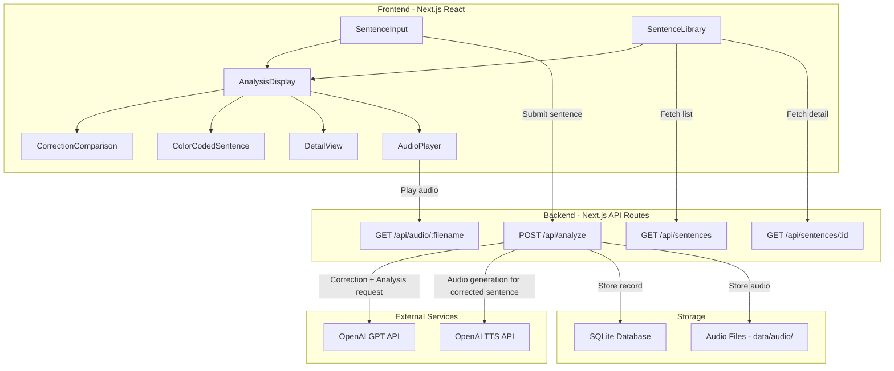
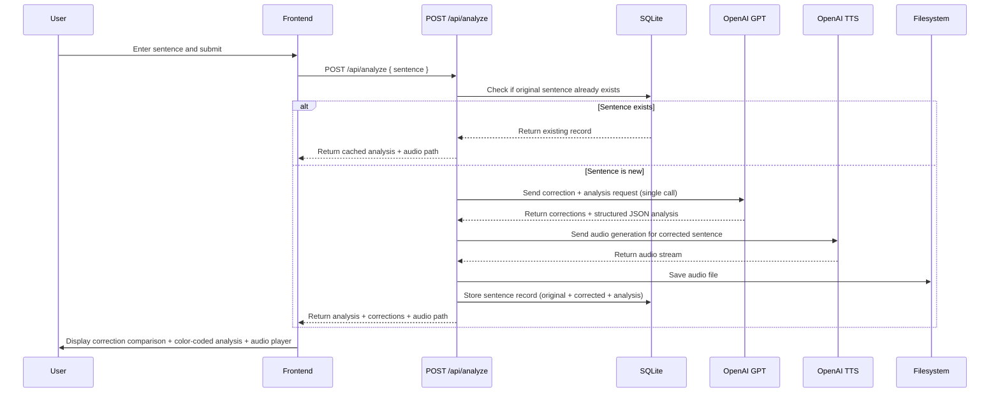

# Design Document

## Overview

A full-stack single-page application built with Next.js (App Router) for deep English sentence learning. Users submit English sentences, and the system first auto-corrects spelling/grammar errors, then performs multi-layer linguistic analysis via OpenAI GPT API and generates audio via OpenAI TTS API. Results are displayed with color-coded grammar components, special highlighting for difficult vocabulary words, a side-by-side correction comparison, and expandable detail views with rich vocabulary explanations. All analysis results and audio are persisted to SQLite and local filesystem, forming a chronological sentence library for review.

The target user scored 80 on TOEFL and is weak at pronunciation, listening, and complex/hard words. The vocabulary analysis is tailored to emphasize difficult words with rich, multi-sentence explanations.

The entire application is English-only — all UI text, analysis output, labels, and prompts are in English.

Tech stack: Next.js 15 (App Router) + TypeScript + SQLite (better-sqlite3) + OpenAI API

## Architecture



### Request Flow



## Components and Interfaces

### Backend Components

#### 1. OpenAI Service Layer (`lib/openai.ts`)

```typescript
async function analyzeSentence(sentence: string): Promise<AnalysisResult>
async function generateAudio(sentence: string): Promise<Buffer>
```

- `analyzeSentence`: Uses OpenAI Chat Completions API with `response_format: { type: "json_schema" }` for structured output. Model: `gpt-4o-mini`. The single GPT call handles both grammar correction and multi-layer analysis — the prompt instructs the model to first correct the sentence, then analyze the corrected version.
- `generateAudio`: Uses OpenAI TTS API (`tts-1` model, `alloy` voice), returns MP3 audio Buffer. Audio is generated for the **corrected** sentence.

#### 2. Database Layer (`lib/db.ts`)

```typescript
function initDatabase(): void
function findSentenceByText(sentence: string): SentenceRecord | undefined
function insertSentence(record: Omit<SentenceRecord, 'id'>): SentenceRecord
function getAllSentences(): SentenceRecord[]
function getSentenceById(id: number): SentenceRecord | undefined
```

Uses `better-sqlite3` synchronous API. The `sentences` table is updated to include `corrected_sentence` column. Duplicate detection matches on the **original** sentence text.

#### 3. API Routes

| Route | Method | Description | Request/Params | Response |
|-------|--------|-------------|----------------|----------|
| `/api/analyze` | POST | Correct + analyze sentence | `{ sentence: string }` | `{ id, sentence, correctedSentence, analysis, audioPath, createdAt }` |
| `/api/sentences` | GET | List all sentences | - | `SentenceRecord[]` |
| `/api/sentences/[id]` | GET | Get sentence detail | URL param `id` | `SentenceRecord` |
| `/api/audio/[filename]` | GET | Serve audio file | URL param `filename` | Audio stream (MP3) |

### Frontend Components

#### 1. Page Layout (`app/page.tsx`)

Single-page app with two sections:
- Top: Sentence input area + analysis result display (correction comparison + color-coded sentence + detail view + audio)
- Bottom: Sentence library list

#### 2. SentenceInput Component

- Text input field + submit button
- Input validation (reject blank content)
- Loading state during submission
- Error message display

#### 3. CorrectionComparison Component (NEW)

- Displays side-by-side comparison of original vs. corrected sentence
- Only rendered when corrections exist (corrections array is non-empty)
- Highlights the specific changes made
- Shows each correction with original text, corrected text, and reason

#### 4. ColorCodedSentence Component (UPDATED)

- Renders the **corrected** sentence with color-coded grammar components, each clickable
- Difficult vocabulary words receive an additional visual indicator (underline + subtle background highlight) to make them stand out from regular grammar coloring
- The component receives a list of difficult words from the vocabulary analysis to apply the extra highlighting

#### 5. DetailView Component (UPDATED)

- No longer displays sentence type
- Vocabulary section shows expanded cards with: IPA pronunciation, part of speech, detailed definition, usage note, and difficulty reason
- Shows clause breakdown, grammar notes, and paraphrase
- Selected component detail panel

#### 6. AudioPlayer Component

- Play/pause button
- Uses HTML5 `<audio>` element for MP3 playback

#### 7. SentenceLibrary Component

- Chronological list (newest first) of saved sentences
- Each entry shows the original sentence and save timestamp
- Click to load full analysis
- Empty state message when library is empty

### Multi-Layer Sentence Analysis Approach

The analysis uses a carefully designed multi-layer approach. The GPT call handles both correction and analysis in a single request:

**Step 0 — Grammar Correction**: Check the input sentence for spelling and grammar errors. Produce a minimally corrected version — fix only errors, do not change word choices or sentence structure. List each correction with original text, corrected text, and reason.

**Layer 1 — Clause Level**: Break the corrected sentence into its constituent clauses (main clause, subordinate clauses). Identify each clause's type and role.

**Layer 2 — Phrase/Chunk Level**: Within each clause, identify the functional chunks: subject phrase, verb phrase, object phrase, adverbial phrases, prepositional phrases, etc. Each chunk is mapped to its position in the **corrected** sentence via character offsets. This is the primary level for color-coded display.

**Layer 3 — Word Level (Key Vocabulary)**: Extract words that are difficult, uncommon, or complex — focusing on B2+ level, academic words, and words commonly confused by TOEFL-level learners. For each word, provide:
- IPA phonetic transcription
- Part of speech
- A detailed, multi-sentence definition (not just a one-liner)
- A contextual usage note explaining how the word functions in this specific sentence
- A difficulty reason explaining why this word is hard or important for English learners

### GPT Prompt Design

The system prompt is engineered to produce correction + consistent, linguistically accurate analysis in a single call:

```
You are an expert English linguist and language teacher helping a TOEFL-level English learner (score ~80) who is weak at pronunciation, listening, and complex/hard words.

Step 0 — Grammar & Spelling Correction:
- Check the input sentence for spelling and grammar errors.
- Produce a minimally corrected version: fix ONLY spelling and grammar errors. Do NOT change the user's word choices, sentence structure, or meaning.
- List each correction: the original text, the corrected text, and a brief reason.
- If no errors are found, set the corrected sentence equal to the original and return an empty corrections list.

Then analyze the CORRECTED sentence using a multi-layer approach:

Layer 1 — Clause Structure:
- Identify each clause (main and subordinate). For each clause, state its type (e.g., independent, relative clause, adverbial clause, noun clause) and its role in the sentence.

Layer 2 — Phrase-Level Chunking:
- Break the corrected sentence into functional phrases/chunks: subject, predicate (verb group), object (direct/indirect), complement, adverbial, prepositional phrase, etc.
- For each chunk, provide:
  - The exact text span
  - The start and end character indices (0-based, inclusive start, exclusive end) — indices are relative to the CORRECTED sentence
  - The grammatical function (e.g., "subject", "main verb", "direct object", "adverbial of time")
  - A brief explanation of its role in the sentence

Layer 3 — Key Vocabulary (focus on DIFFICULT words):
- Select words that are difficult, uncommon, or complex: B2+ level, academic words, words commonly confused by TOEFL-level learners.
- For each word, provide:
  - The word form as it appears
  - IPA phonetic transcription
  - Part of speech
  - A DETAILED definition (2-3 sentences, not just a one-liner)
  - A usage note explaining how the word functions in this specific sentence
  - A difficulty reason explaining why this word is hard or important for English learners

Also provide:
- A list of grammar points worth noting (tenses, voice, mood, notable constructions)
- The overall meaning of the sentence in one clear paraphrase

Be precise with character indices relative to the corrected sentence. Do not skip any part of the corrected sentence in the phrase-level chunking — every word must belong to exactly one chunk.
```

Uses OpenAI Structured Outputs (`response_format: { type: "json_schema" }`) to enforce consistent JSON format.

## Data Models

### Correction Type (NEW)

```typescript
interface Correction {
  original: string;      // The original text that was wrong
  corrected: string;     // The corrected text
  reason: string;        // Brief reason for the correction
}
```

### AnalysisResult Type (UPDATED)

```typescript
interface Clause {
  text: string;
  type: string;
  role: string;
}

interface GrammarComponent {
  text: string;
  role: string;
  startIndex: number;    // Relative to corrected sentence
  endIndex: number;      // Relative to corrected sentence
  description: string;
}

interface VocabularyItem {
  word: string;
  phonetic: string;          // IPA phonetic transcription
  partOfSpeech: string;
  definition: string;        // Detailed multi-sentence definition
  usageNote: string;         // Contextual usage in this sentence
  difficultyReason: string;  // NEW: Why this word is hard/important
}

interface AnalysisResult {
  // sentenceType REMOVED
  originalSentence: string;      // NEW: The user's original input
  correctedSentence: string;     // NEW: The corrected version
  corrections: Correction[];     // NEW: List of corrections made
  clauses: Clause[];
  components: GrammarComponent[];    // Indices relative to correctedSentence
  vocabulary: VocabularyItem[];
  grammarNotes: string[];
  paraphrase: string;
}
```

### SentenceRecord Type (UPDATED)

```typescript
interface SentenceRecord {
  id: number;
  sentence: string;                  // Original English sentence (user input)
  correctedSentence: string;         // NEW: Corrected version
  analysis: AnalysisResult;          // Analysis result (stored as JSON)
  audioFilename: string | null;      // Audio filename (null if TTS failed)
  createdAt: string;                 // ISO 8601 timestamp
}
```

### SQLite Table Schema (UPDATED)

```sql
CREATE TABLE IF NOT EXISTS sentences (
  id INTEGER PRIMARY KEY AUTOINCREMENT,
  sentence TEXT NOT NULL UNIQUE,
  corrected_sentence TEXT NOT NULL,       -- NEW column
  analysis TEXT NOT NULL,
  audio_filename TEXT,
  created_at TEXT NOT NULL DEFAULT (datetime('now'))
);
```

Migration for existing data: Add `corrected_sentence` column with default equal to `sentence` value.

### Audio File Storage

- Directory: `data/audio/`
- Naming: SHA-256 hash of **corrected** sentence content (first 16 hex chars) + `.mp3`
- Example: `a1b2c3d4e5f6g7h8.mp3`

### Color Mapping (UPDATED)

| Grammar Role | Color | Label |
|-------------|-------|-------|
| subject | Blue (#3B82F6) | Subject |
| predicate | Red (#EF4444) | Predicate |
| direct_object | Green (#22C55E) | Object |
| indirect_object | Emerald (#10B981) | Ind. Object |
| complement | Cyan (#06B6D4) | Complement |
| adverbial | Orange (#F97316) | Adverbial |
| prepositional | Purple (#A855F7) | Prep. Phrase |
| conjunction | Gray (#6B7280) | Conjunction |
| other | Slate (#64748B) | Other |

Difficult vocabulary words additionally receive: a dashed underline and a subtle yellow background highlight (`#FEF9C3`) overlaid on their grammar color, making them visually distinct.


## Correctness Properties

*A property is a characteristic or behavior that should hold true across all valid executions of a system — essentially, a formal statement about what the system should do. Properties serve as the bridge between human-readable specifications and machine-verifiable correctness guarantees.*

### Property 1: AnalysisResult Structural Completeness

*For any* valid English sentence submitted to the analyzer, the returned AnalysisResult must contain: `originalSentence` (non-empty string), `correctedSentence` (non-empty string), `corrections` (array where each item has `original`, `corrected`, and `reason` strings), a non-empty `clauses` array where each clause has `text`, `type`, and `role`, a non-empty `components` array where each component has `text`, `role`, `startIndex`, `endIndex`, and `description`, a `vocabulary` array where each item has `word`, `phonetic`, `partOfSpeech`, `definition`, `usageNote`, and `difficultyReason` fields, a non-empty `grammarNotes` array, and a non-empty `paraphrase` string.

**Validates: Requirements 2.3, 3.1, 3.2, 4.2**

### Property 2: Whitespace Input Rejection

*For any* string composed entirely of whitespace characters (spaces, tabs, newlines, or empty string), submitting it to POST /api/analyze should return a 400 status code with a validation error, and no new record should be created in the Sentence_Library.

**Validates: Requirements 1.2**

### Property 3: Invalid JSON Response Handling

*For any* GPT API response that does not conform to the AnalysisResult JSON schema, the Sentence_Analyzer should return a parse error rather than crash, and the error response should contain an actionable message.

**Validates: Requirements 3.3**

### Property 4: Grammar Component Indices Valid Relative to Corrected Sentence

*For any* valid AnalysisResult, every GrammarComponent's `startIndex` and `endIndex` should be valid indices within the `correctedSentence` string (0 <= startIndex < endIndex <= correctedSentence.length), and the substring `correctedSentence.slice(startIndex, endIndex)` should equal the component's `text` field.

**Validates: Requirements 2.5**

### Property 5: Correction Consistency

*For any* AnalysisResult where `originalSentence` equals `correctedSentence`, the `corrections` array should be empty. Conversely, if `corrections` is non-empty, `originalSentence` should differ from `correctedSentence`.

**Validates: Requirements 2.4**

### Property 6: Sentence Record Round-Trip with Corrections

*For any* SentenceRecord successfully created via POST /api/analyze, fetching it by its id via GET /api/sentences/[id] should return a record with identical `sentence`, `correctedSentence`, `analysis`, and `audioFilename` fields.

**Validates: Requirements 2.6, 7.1**

### Property 7: Sentence Submission Idempotence

*For any* English sentence, submitting the same sentence twice should return the same Analysis_Result, correctedSentence, and audioFilename on both submissions, and the Sentence_Library should contain exactly one record for that sentence.

**Validates: Requirements 7.3**

### Property 8: Sentence List Chronological Order

*For any* Sentence_Library containing multiple records, GET /api/sentences should return a list where each record's `createdAt` timestamp is greater than or equal to the next record's `createdAt` (reverse chronological order).

**Validates: Requirements 7.2**

### Property 9: API Error Response Format

*For any* invalid request sent to any API endpoint (missing required fields, invalid ID, non-existent resource), the system should return an appropriate HTTP status code (400/404/500) and a structured JSON response containing an `error` field.

**Validates: Requirements 9.5**

### Property 10: DetailView Display Completeness

*For any* valid AnalysisResult, the DetailView rendered output should contain: each VocabularyItem's word, phonetic transcription, part of speech, definition, usage note, and difficulty reason; the clause breakdown; grammar notes; and the paraphrase text.

**Validates: Requirements 4.4, 6.3, 6.4**

### Property 11: Difficult Word Visual Highlighting

*For any* ColorCodedSentence component rendered with a vocabulary list, grammar components whose text matches a vocabulary word should receive the additional difficulty highlight styling (dashed underline and yellow background).

**Validates: Requirements 4.3**

### Property 12: Correction Comparison Display

*For any* AnalysisResult with a non-empty corrections array, the CorrectionComparison component should render both the original sentence and the corrected sentence, and display each correction's original text, corrected text, and reason.

**Validates: Requirements 6.6**

### Property 13: Audio Filename Based on Corrected Sentence

*For any* sentence where correction occurs, the audio filename should be derived from the SHA-256 hash of the corrected sentence (not the original), ensuring audio matches the corrected pronunciation.

**Validates: Requirements 5.1, 5.3**

## Error Handling

### API Error Handling

| Error Scenario | HTTP Status | Error Response | Strategy |
|---------------|-------------|----------------|----------|
| Blank input | 400 | `{ error: "Sentence cannot be empty" }` | Frontend + backend dual validation |
| OpenAI GPT API failure | 502 | `{ error: "Analysis service temporarily unavailable, please retry" }` | Return error, do not store record |
| GPT returns invalid JSON | 502 | `{ error: "Analysis result parsing failed, please retry" }` | Return error, do not store record |
| OpenAI TTS API failure | 200 (degraded) | Normal analysis result with `audioFilename: null` | Audio failure does not block analysis |
| Sentence ID not found | 404 | `{ error: "Sentence record not found" }` | Return 404 |
| Audio file not found | 404 | `{ error: "Audio file not found" }` | Return 404 |
| Database operation failure | 500 | `{ error: "Internal server error" }` | Log error, return generic message |

### Frontend Error Handling

- Network errors: Display "Network connection failed, please check your connection and retry"
- API errors: Display the error message returned by the backend
- All error states provide a retry button
- Audio load failure: Hide play button, do not affect analysis display

### Degradation Strategy

- When TTS audio generation fails, analysis results display normally; audio play button is hidden
- This ensures the core feature (sentence analysis) is not affected by audio service issues

## Testing Strategy

### Framework Selection

- **Unit tests + Property tests**: Vitest
- **Property testing library**: fast-check (integrates with Vitest)
- **Component tests**: React Testing Library

### Property-Based Testing

Use fast-check library for property-based tests. Each property test runs a minimum of 100 iterations.

Each property test must be annotated with a comment referencing the design document property:

```typescript
// Feature: sentence-learning, Property 4: Grammar Component Indices Valid Relative to Corrected Sentence
test.prop([validAnalysisResultArb], (result) => {
  for (const comp of result.components) {
    expect(comp.startIndex).toBeGreaterThanOrEqual(0);
    expect(comp.endIndex).toBeLessThanOrEqual(result.correctedSentence.length);
    expect(result.correctedSentence.slice(comp.startIndex, comp.endIndex)).toBe(comp.text);
  }
});
```

Property test coverage:
- **Property 1**: AnalysisResult structural completeness
- **Property 2**: Whitespace input rejection
- **Property 4**: Grammar component indices valid relative to corrected sentence
- **Property 5**: Correction consistency
- **Property 6**: Sentence record round-trip
- **Property 7**: Sentence submission idempotence
- **Property 8**: Sentence list chronological order
- **Property 9**: API error response format
- **Property 10**: DetailView display completeness
- **Property 11**: Difficult word visual highlighting
- **Property 12**: Correction comparison display
- **Property 13**: Audio filename based on corrected sentence

### Unit Tests

Unit tests cover specific examples and edge cases:

- **Input validation**: Empty string, whitespace-only, very long text
- **API routes**: Normal and abnormal requests for each endpoint
- **Database operations**: CRUD, duplicate sentence handling, corrected_sentence storage
- **Audio files**: Hash-based naming using corrected sentence, file read/write
- **Error scenarios**: API failure, JSON parse failure, file not found
- **Frontend components**: Color mapping, vocabulary card rendering, correction comparison, empty state, loading state
- **Correction display**: Side-by-side comparison rendering, empty corrections case

### Test Directory Structure

```
__tests__/
  lib/
    openai.test.ts          # OpenAI service layer tests
    db.test.ts              # Database layer tests
  api/
    analyze.test.ts         # /api/analyze endpoint tests
    sentences.test.ts       # /api/sentences endpoint tests
    sentences-id.test.ts    # /api/sentences/[id] endpoint tests
    audio-filename.test.ts  # /api/audio/[filename] endpoint tests
  components/
    SentenceInput.test.tsx
    ColorCodedSentence.test.tsx
    DetailView.test.tsx
    CorrectionComparison.test.tsx
    SentenceLibrary.test.tsx
    Page.test.tsx
  properties/
    analysis.property.ts    # Analysis-related property tests
    storage.property.ts     # Storage-related property tests
    api.property.ts         # API-related property tests
    display.property.ts     # Display-related property tests
```
